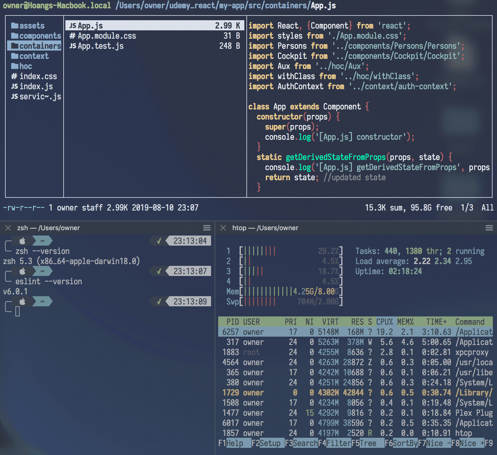

# dotfiles
My config files used in various UNIX / Linux applications, mostly Vim. *Not everything* is written by me

Tested on: **macOS** 10.14, **Vim** 8.1 (1-1722) on MacVim, **zsh** 5.3 on **iTerm2** 3.3.1, **eslint** v6.0.1

## Installation

